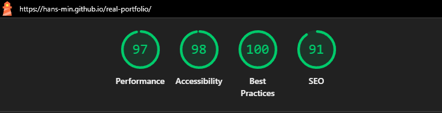

## Requirements

- [x] Hébergeur trouvé : **GitHub Pages**
- [x] Choix CMS / Développement: **Svelte**

- [X] Analyse du Traffic / mise en place d'outils: **Google Search Console**
- [x] Lien avec les Réseaux Sociaux / Cohérence: **Github, LinkedIn**
- [x] Réalisation des contenus
- [x] Traduction des contenus (2 langues minimums): **en, fr**
- [x] Relectures des contenus / Traductions
- [x] Tests utilisateur du site
- [x] Mentions légales / Copyright
- [x] conformité RGDP
- [x] Formulaire de Contact

### Other tests
- [x] Tests d'Accessibilité / Performances 
- [x] SEO optimized
- [x] Site Responsive - tests responsive effectués: **Mobile First: Lighthouse Test on mobile**

